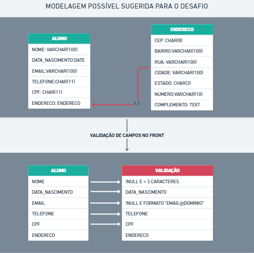

# Desafio Técnico - Plataforma Ensinar

## Resumo

Você foi chamado para construir uma aplicação que cadastre alunos em uma plataforma de ensino chamada <b> Ensinar </b>. O objetivo da solução é organizar e proteger as informações sensíveis dos alunos.

Para realizar essa tarefa, você deve construir uma aplicação web em ReactJS utilizando TypeScript, que permita cadastrar, alterar, visualizar e remover alunos.

De preferência, utilize as seguintes abordagens e tecnologias na construção do sistema:

- **Build**: ViteJS
- **Componentes**: MaterialUI
- **Armazenamento**: *In memory*

É importante sugerir e validar um modelo de dados durante o processo de entrada de informações.

O código deve ser versionado com Git, registrado em um repositório do GitHub e o link deve ser compartilhado.

## 🔰 Imagens

### Logo

### Modelagem - link <a href="https://whimsical.com/plataforma-ensinar-PxSNGa428pNUvHXmoyq72n"> 🔗<a/>

## 🔨 Funcionalidades do projeto

- [x] Cadastro de aluno
- [ ] Update de aluno 
- [x] Visualização de aluno
- [x] Remoção de aluno

## ✔️ Técnicas e tecnologias utilizadas

- ``React Js``
- ``TypeScript``
- ``MaterialUI``
- ``Whimsical``
- ``Canva``
- ``StyledComponents``
- ``ReactHookForm com Yup``
- ``FontAwesome``
- ``LocalStorage``

